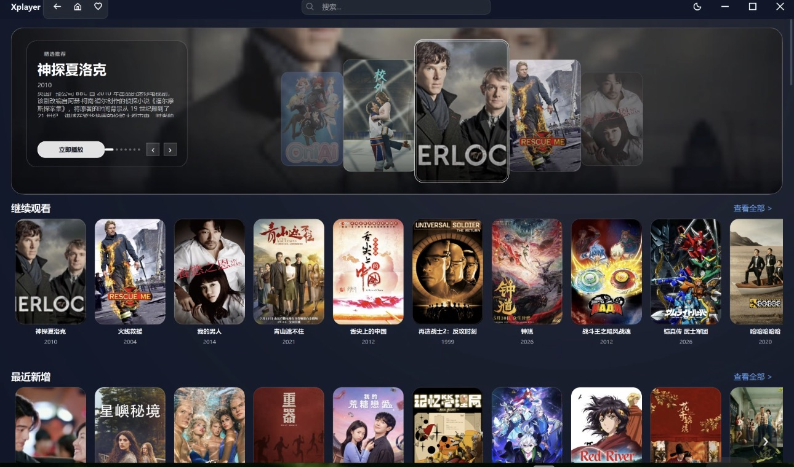
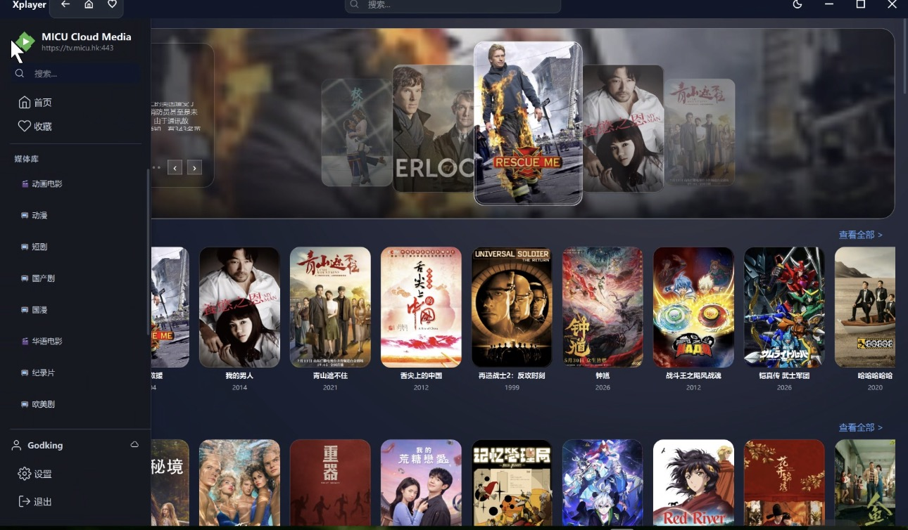
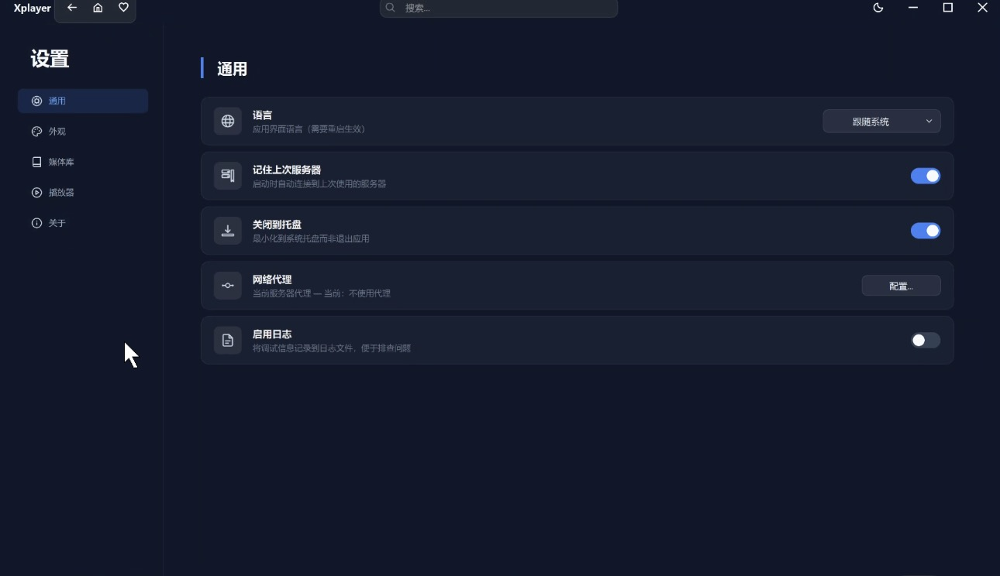

<p align="center">
  
</p>

<h1 align="center">Xplayer</h1>

<p align="center">
  <b>为 Emby 与 Jellyfin 打造的原生桌面影音中心</b><br/>
  <b>快、稳、顺，专注高质量媒体浏览与播放体验</b>
</p>

<p align="center">
  <a href="LICENSE"></a>
  <a href="https://github.com/xtq94kws7z-droid/Xplayer/releases/latest"></a>
  
  
  
</p>

<p align="center">
  <a href="#中文">中文</a> | <a href="#english">English</a>
</p>

---

<a id="中文"></a>

## Xplayer 是什么

Xplayer 是一款面向 Emby / Jellyfin 用户的现代桌面播放器。它不是浏览器套壳，而是基于 **Qt 6、C++20 与 libmpv** 构建的原生客户端，专注于快速浏览媒体库、自然流畅的页面交互，以及稳定可靠的本地播放体验。

从海报墙、影片详情、搜索和媒体管理，到弹幕、播放列表与下载管理，Xplayer 希望把家庭媒体库真正变成一套顺手、漂亮、可以长期使用的桌面影音中心。

## 📸 应用截图

<p align="center">
  
  
</p>
<p align="center">
  
  
</p>

## 📥 下载

最新版本：**v1.0.4**

| 安装包 | 说明 |
|---|---|
| [Xplayer-1.0.4-Setup.exe](https://github.com/xtq94kws7z-droid/Xplayer/releases/download/v1.0.4/Xplayer-1.0.4-Setup.exe) | Windows 10/11 x64 安装包 |

旧版本可以在 [Releases](https://github.com/xtq94kws7z-droid/Xplayer/releases) 页面下载。

## 🚀 v1.0.4 更新内容

- 针对首页海报墙、媒体列表和详情页滚动进行专项流畅度优化。
- 改进海报、背景图与演员图片的异步加载、缓存和渐进显示体验。
- 优化首页到详情页的交互反馈、页面切换和快速返回时的生命周期处理。
- 修复多处长标题、按钮文字和不同窗口尺寸下的布局显示问题。
- 加固 Windows 安装与应用内升级流程，修复快捷方式权限和打包路径问题。
- 完善网络异常、快速连续操作和异步任务结束后的状态保护。

## ✨ 功能特性

- 🎬 浏览和管理你的 Emby / Jellyfin 媒体库
- ▶️ 内置 **libmpv** 驱动的视频播放器
- 💬 弹幕播放，支持弹弹Play与 LogVar / danmu_api、搜索、匹配、缓存和原生覆盖层渲染
- 🧩 支持元数据编辑、媒体识别、图片更新和播放列表管理
- 📥 下载管理器
- 🔄 自动检查更新和 Windows 应用内升级
- 🖥️ 可选单例应用模式
- 🌗 深色 / 浅色主题切换
- 🌐 国际化支持（中文 / 英文 / 法语）
- 🔍 支持搜索历史的媒体搜索
- 📺 当前支持电视剧、电影媒体类型
- 📦 提供 Windows 10/11 x64 安装包和绿色便携版
- ⚡ 基于 C++20 协程的异步操作（QCoro）
- 🪟 原生风格的自定义窗口边框（QWindowKit）

## 💻 平台支持

| 平台 | 状态 |
|---|---|
| Windows 10/11 x64 | ✅ 已适配 |

## 📋 开发路线图

- [x] Emby / Jellyfin 媒体库浏览
- [x] 内置视频播放器（libmpv）
- [x] 深色 / 浅色主题
- [x] 国际化支持（中文 / 英文）
- [x] 媒体搜索与搜索历史
- [x] 电视剧、电影支持
- [x] 服务器管理仪表盘
- [x] 支持添加到播放列表和从播放列表中移除
- [x] 支持识别来更新元数据
- [x] 支持修改元数据和图片
- [x] 弹幕系统（搜索、匹配、设置、渲染）
- [x] 下载管理器
- [x] 自动检查更新和 Windows 应用内升级
- [x] 单例应用模式
- [x] 多弹幕源支持（弹弹Play / danmu_api）
- [ ] AI 字幕生成

> 本项目为个人兴趣开发，欢迎贡献和反馈！

## 🛠️ 技术栈

| 组件 | 技术 |
|---|---|
| 框架 | Qt 6.x (Widgets) |
| 语言 | C++20 |
| 视频播放 | libmpv |
| 异步 | QCoro (Qt C++20 协程) |
| 日志 | spdlog |
| 窗口框架 | QWindowKit |
| 构建系统 | CMake |

## 📦 环境要求

- **Qt 6.x**（包含 Widgets、Core、Network、Concurrent、OpenGLWidgets、LinguistTools、WebSockets 模块）
- **CMake** ≥ 3.16
- 支持 **C++20** 的编译器（推荐 MSVC 2022）
- **libmpv** 开发文件（见下方说明）
- **Git**（用于克隆子模块）

## 🚀 构建指南

### 1. 克隆仓库

```bash
git clone --recursive https://github.com/xtq94kws7z-droid/Xplayer.git
cd Xplayer
```

### 2. 获取 libmpv

下载 libmpv 开发包，并放置到 `libs/libmpv/` 目录下，结构如下：

```
libs/libmpv/
├── bin/
│   └── libmpv-2.dll
├── include/
│   └── mpv/
│       ├── client.h
│       └── render.h (等)
└── lib/
    └── libmpv.dll.a
```

libmpv 获取方式：
- [shinchiro/mpv-winbuild-cmake](https://github.com/shinchiro/mpv-winbuild-cmake/releases)（Windows 预编译版本）
- [mpv-player/mpv](https://github.com/mpv-player/mpv)（从源码编译）

### 3. 配置和构建

```bash
cmake -B build -DCMAKE_PREFIX_PATH="/path/to/Qt6/lib/cmake"
cmake --build build --config Release
```

> **提示：** 在 Windows 上使用 MSVC 时，也可以直接在 Qt Creator 或 Visual Studio 中打开 CMake 项目。
>
> 在 Windows 上使用项目内置的 Qt MinGW 工具链时，建议执行
> `powershell -ExecutionPolicy Bypass -File scripts/build-xplayer.ps1`。
> 该脚本会先注入 MinGW 运行时路径并执行最小编译探针，避免 `cc1plus.exe`
> 因找不到 `libwinpthread-1.dll` 而出现大量无诊断构建失败。

## 📁 项目结构

```
Xplayer/
├── CMakeLists.txt              # 根 CMake 配置
├── libs/
│   ├── libmpv/                 # libmpv SDK（未纳入版本控制，见构建指南）
│   └── qwindowkit/             # QWindowKit（git 子模块）
└── src/
    ├── XplayerCore/              # 核心库（API、模型、服务）
    │   ├── api/                # Emby/Jellyfin API 客户端
    │   ├── config/             # 配置管理
    │   ├── models/             # 数据模型
    │   └── services/           # 业务逻辑服务
    └── XplayerApp/               # 桌面应用
        ├── components/         # 可复用 UI 组件
        ├── managers/           # 应用管理器
        ├── resources/          # 图标、主题、翻译
        ├── utils/              # 工具类
        └── views/              # 应用视图
```

> **注意：** 本项目是个人开发的测试版本，建议在非关键设备上体验。如有问题请通过 [GitHub Issues](https://github.com/xtq94kws7z-droid/Xplayer/issues) 反馈。

## 📄 许可证

本项目基于 [MIT 许可证](LICENSE) 开源。

## 🙏 致谢

- [Qt](https://www.qt.io/) — 应用框架 (LGPL v3)
- [mpv](https://mpv.io/) — 媒体播放引擎 (LGPL v2.1+)
- [QWindowKit](https://github.com/stdware/qwindowkit) — 自定义窗口框架 (Apache-2.0)
- [QCoro](https://github.com/danvratil/qcoro) — Qt C++20 协程库 (MIT)
- [spdlog](https://github.com/gabime/spdlog) — 高性能日志库 (MIT)

---

<a id="english"></a>

## What is Xplayer?

Xplayer is a modern desktop client for Emby and Jellyfin. Built natively with **Qt 6, C++20, and libmpv**, it focuses on responsive media-library browsing, fluid interaction, and dependable local playback without relying on a browser shell.

## 📸 Screenshots

<p align="center">
  
  
</p>
<p align="center">
  
  
</p>

## 📥 Download

Latest release: **v1.0.4**

| Package | Description |
|---|---|
| [Xplayer-1.0.4-Setup.exe](https://github.com/xtq94kws7z-droid/Xplayer/releases/download/v1.0.4/Xplayer-1.0.4-Setup.exe) | Windows 10/11 x64 installer |

Older releases are available on the [Releases](https://github.com/xtq94kws7z-droid/Xplayer/releases) page.

## 🚀 What's New in v1.0.4

- Targeted smoothness improvements for the home poster wall, media lists, and detail-page scrolling.
- Improved asynchronous loading, caching, and progressive display for posters, backdrops, and cast images.
- Faster interaction feedback and safer lifecycle handling when entering or leaving detail pages quickly.
- Fixed long-title, button-label, and responsive layout issues across different window sizes.
- Hardened Windows installation and in-app update paths, including shortcut permission handling.
- Improved state safety around network failures, rapid repeated input, and completed asynchronous work.

## ✨ Features

- 🎬 Browse and manage your Emby / Jellyfin media library
- ▶️ Built-in video player powered by **libmpv**
- 💬 Danmaku playback with DandanPlay and LogVar / danmu_api, search, matching, cache and native overlay rendering
- 🧩 Metadata editing, media identification, image updates and playlist tools
- 📥 Download manager
- 🔄 Automatic update checks and in-app Windows updates
- 🖥️ Optional single-application mode
- 🌗 Dark and Light theme support
- 🌐 Internationalization support (Chinese / English / French)
- 🔍 Media search with history
- 📺 TV series and movies media types
- 📦 Windows 10/11 x64 installer and portable package
- ⚡ Asynchronous operations with C++20 coroutines (QCoro)
- 🪟 Custom window frame with native look (QWindowKit)

## 💻 Platform Support

| Platform | Status |
|---|---|
| Windows 10/11 x64 | ✅ Supported |

## 📋 Roadmap

- [x] Emby / Jellyfin media library browsing
- [x] Built-in video player (libmpv)
- [x] Dark / Light theme
- [x] Internationalization (Chinese / English)
- [x] Media search with history
- [x] TV series & movies support
- [x] Server administration dashboard
- [x] Playlist support (add/remove items)
- [x] Media identification & metadata refresh
- [x] Metadata and image editing
- [x] Danmaku (bullet comments) system
- [x] Download manager
- [x] Automatic update checks and in-app Windows updates
- [x] Single-application mode
- [x] Multiple danmaku providers (DandanPlay / danmu_api)
- [ ] AI-powered subtitle generation

> This is an independently developed Windows desktop test release. Contributions and feedback are welcome!

## 🛠️ Tech Stack

| Component | Technology |
|---|---|
| Framework | Qt 6.x (Widgets) |
| Language | C++20 |
| Video Player | libmpv |
| Async | QCoro (C++20 Coroutines for Qt) |
| Logging | spdlog |
| Window Kit | QWindowKit |
| Build System | CMake |

## 📦 Prerequisites

- **Qt 6.x** (with Widgets, Core, Network, Concurrent, OpenGLWidgets, LinguistTools, WebSockets)
- **CMake** ≥ 3.16
- **C++20** compatible compiler (MSVC 2022 recommended)
- **libmpv** development files (see below)
- **Git** (for cloning submodules)

## 🚀 Build

### 1. Clone the repository

```bash
git clone --recursive https://github.com/xtq94kws7z-droid/Xplayer.git
cd Xplayer
```

### 2. Get libmpv

Download the libmpv development package and place it in `libs/libmpv/` with the following structure:

```
libs/libmpv/
├── bin/
│   └── libmpv-2.dll
├── include/
│   └── mpv/
│       ├── client.h
│       └── render.h (etc.)
└── lib/
    └── libmpv.dll.a
```

You can get libmpv from:
- [shinchiro/mpv-winbuild-cmake](https://github.com/shinchiro/mpv-winbuild-cmake/releases) (Windows builds)
- [mpv-player/mpv](https://github.com/mpv-player/mpv) (build from source)

### 3. Configure and build

```bash
cmake -B build -DCMAKE_PREFIX_PATH="/path/to/Qt6/lib/cmake"
cmake --build build --config Release
```

> **Tip:** On Windows with MSVC, you can also open the project in Qt Creator or Visual Studio with CMake support.
>
> When using the bundled Qt MinGW toolchain on Windows, prefer
> `powershell -ExecutionPolicy Bypass -File scripts/build-xplayer.ps1`.
> The script injects the MinGW runtime path and runs a minimal compiler probe before
> building, preventing silent failures when `cc1plus.exe` cannot load `libwinpthread-1.dll`.

## 📁 Project Structure

```
Xplayer/
├── CMakeLists.txt              # Root CMake configuration
├── libs/
│   ├── libmpv/                 # libmpv SDK (not tracked, see Build section)
│   └── qwindowkit/             # QWindowKit (git submodule)
└── src/
    ├── XplayerCore/              # Core library (API, models, services)
    │   ├── api/                # Emby/Jellyfin API client
    │   ├── config/             # Configuration management
    │   ├── models/             # Data models
    │   └── services/           # Business logic services
    └── XplayerApp/               # Desktop application
        ├── components/         # Reusable UI components
        ├── managers/           # Application managers
        ├── resources/          # Icons, themes, translations
        ├── utils/              # Utility classes
        └── views/              # Application views
```

> **Note:** This is an independently developed test release. Try it on non-critical systems and report issues through [GitHub Issues](https://github.com/xtq94kws7z-droid/Xplayer/issues).

## 📄 License

This project is licensed under the [MIT License](LICENSE).

## 🙏 Acknowledgements

- [Qt](https://www.qt.io/) — Application framework (LGPL v3)
- [mpv](https://mpv.io/) — Media player engine (LGPL v2.1+)
- [QWindowKit](https://github.com/stdware/qwindowkit) — Custom window frame (Apache-2.0)
- [QCoro](https://github.com/danvratil/qcoro) — C++20 Coroutines for Qt (MIT)
- [spdlog](https://github.com/gabime/spdlog) — Fast logging library (MIT)
